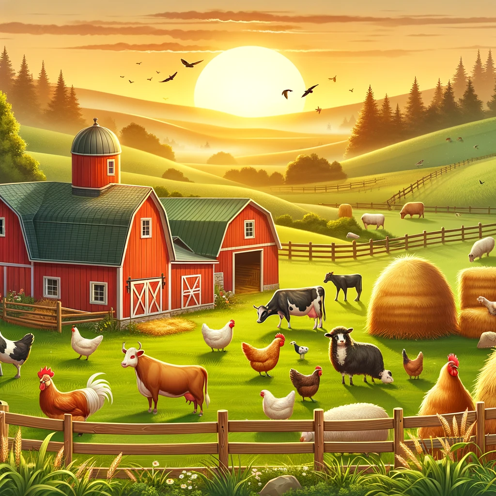

## Description
A Simple Saturation Adjustor that , takes in a saturation factory float number. Then loops through each pixel of an image , adjust the saturation faction in the HSV codec. Then save the new image as outputImage

### Install the Libraries Using
In an Ubuntu Environment
```
sudo apt-get update
sudo apt-get install libopencv-dev
```

### Run the Code Using
``` 
nvcc saturation.cu main.cu -o main $(pkg-config --cflags --libs opencv); ./main
```

### Sample Image Run 

#### Initial Image


#### Output Image
